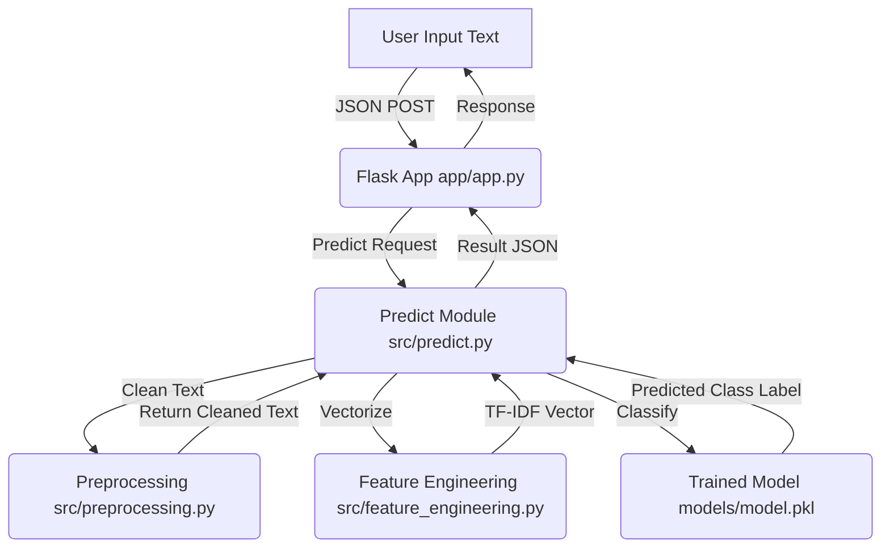

# AI Mood Detection Codebase Working Guide

This guide describes the complete architecture, pipeline, and internal workings of the **AI Mood Detection from Text** project.

---

## 1. System Architecture & Flow

The application functions as a classic machine learning pipeline integrated with a web application:

---

## 2. Directory Structure

The repository is organized cleanly to separate data, training assets, model files, core source code, and web components:

* **`app/`**: Holds the web server, templates, and static resources.
  * `app.py`: Entry point for the Flask web application.
  * `templates/index.html`: The user interface template.
  * `static/`: Contains client-side CSS and JS files.
* **`src/`**: Contains the core machine learning pipeline logic.
  * `preprocessing.py`: Handles text cleaning, formatting, and lemmatization.
  * `feature_engineering.py`: Configures the TF-IDF Vectorizer.
  * `train_model.py`: Trains and compares multiple models on the dataset.
  * `predict.py`: Handles single-text inference caching and pipeline execution.
  * `utils.py`: Centralized path utilities and pickle saving/loading.
* **`data/`**: Project dataset storage.
  * `processed/final_cleaned_data.csv.xls`: Pre-cleaned academic training dataset.
* **`models/`**: Stores serialized trained files (`model.pkl` and `vectorizer.pkl`).

---

## 3. Detailed Component Breakdown

### A. Utility Helpers (`src/utils.py`)
Provides cross-platform absolute path resolution relative to the project root and handles saving/loading of Python objects via Pickle.
* [utils.py](file:///c:/Users/ahmad/Desktop/project%20sem-2/Mood-Detection-AI/src/utils.py) defines paths dynamically so they don't break whether run from `app/` or `src/`.

### B. Text Preprocessing (`src/preprocessing.py`)
Converts raw, messy conversational text into normalized tokens:
1. **Case Normalization**: Converts all text to lowercase.
2. **Regex Filtering**: Removes non-alphabetic characters (punctuations, numbers).
3. **Length Filtering**: Discards short words (less than 3 characters).
4. **Lemmatization (NLTK)**: Normalizes words to their dictionary form (e.g. "feeling" -> "feel").
   * *Graceful Fallback*: If NLTK or `wordnet` is not installed or crashes, it automatically falls back to basic regex cleaning so the application doesn't crash.

### C. Feature Engineering (`src/feature_engineering.py`)
Converts text into numerical feature vectors using **TF-IDF (Term Frequency-Inverse Document Frequency)**:
* Uses unigrams and bigrams (`ngram_range=(1, 2)`).
* Filters out common English stop words (`stop_words='english'`).
* Employs `sublinear_tf=True` to scale word frequencies logarithmically.
* Limits features to `max_features=5000` to prevent overfitting.

### D. Model Training (`src/train_model.py`)
Performs data training and model selection:
1. Loads the processed dataset `final_cleaned_data.csv.xls`.
2. Applies preprocessing and extracts TF-IDF features.
3. Splits data into **80% training** and **20% testing** sets.
4. Trains and evaluates four different models:
   * **Linear SVM** (SVC with Linear kernel) — *Best performing model*
   * **RBF SVM** (SVC with Radial Basis Function kernel)
   * **Random Forest Classifier**
   * **Gradient Boosting Classifier**
5. Automatically picks the best performing model based on test-set accuracy and serializes both the model and the vectorizer to the `models/` folder.

### E. Inference Engine (`src/predict.py`)
Handles real-time classification for the web app:
* **Assets Caching**: Loads `model.pkl` and `vectorizer.pkl` lazily from disk and stores them in global memory variables (`_model` and `_vectorizer`) to prevent slow disk reads on every request.
* **Pipeline Execution**: Cleans user text, vectorizes it using the pre-fit TF-IDF configuration, and runs SVM prediction.

### F. Web Interface & Backend (`app/app.py`)
Sets up a Flask REST API:
* **`GET /`**: Renders the index page.
* **`POST /predict`**: Accepts a JSON body `{"text": "your text"}`, passes the text to `predict_mood()`, and returns the predicted mood label back as JSON.

---

## 4. Current Model Performance

The best model is **SVM (Linear)** with parameter `C=1`. It performs with high accuracy across 8,273 samples:

| Metric | Score |
| :--- | :--- |
| **Accuracy** | **85.14%** |
| **Precision** | **85.26%** |
| **Recall** | **85.14%** |
| **F1-Score** | **84.73%** |

### Per-Emotion Precision & Performance Breakdown:
* **Sadness**: **90%** precision, **90%** recall, **90%** F1-score.
* **Anger**: **89%** precision, **83%** recall, **86%** F1-score.
* **Fear**: **87%** precision, **77%** recall, **82%** F1-score.
* **Love**: **83%** precision, **58%** recall, **68%** F1-score.
* **Joy**: **81%** precision, **94%** recall, **87%** F1-score.
* **Surprise**: **77%** precision, **54%** recall, **64%** F1-score.
