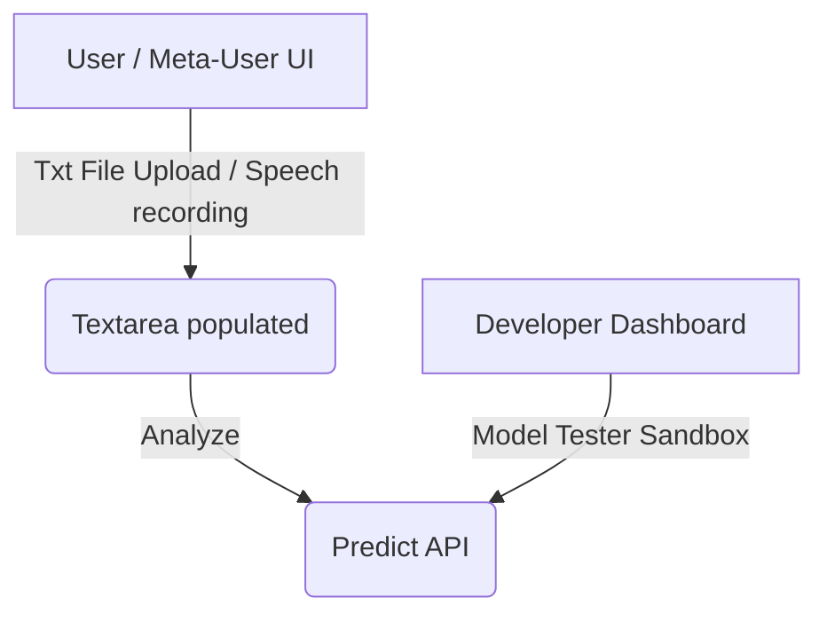

# Implementation Plan - Restructuring Roles, File Uploads, and Voice Inputs

This updated plan details the addition of file reading capabilities, Speech-to-Text microphone inputs, developer sandboxes, role-based feedback verification, and a database purge.

---

## User Review Required

> [!IMPORTANT]
> **Database Purge**: We will wipe all historical sessions, predictions, corrections, and test users, seeding exactly the developer (`admin`/`adminpassword`) and the meta-user (`meta`/`metapassword`) accounts.

> [!NOTE]
> **New Inputs & Features**:
> 1. **File Upload Option (All Users)**: A button allowing users to upload a `.txt` file. The application reads the text paragraphs client-side and populates the text area for analysis.
> 2. **Microphone Speech-to-Text (Meta-Users only)**: A microphone button that leverages the browser's native `WebSpeech` API to record voice inputs, transcribe them in real time into the text area, and trigger mood analysis.

---

## Proposed Changes

### 1. Database & Seeding Purge (`app/services/db_service.py`)
- [MODIFY] [db_service.py](file:///c:/Users/ahmad/Desktop/project%20sem-2/Mood-Detection-AI/app/services/db_service.py):
  - Force purge database files on next execution.
  - Pre-seed:
    - Admin developer (`admin` / `adminpassword`, role `developer`).
    - Meta-User (`meta` / `metapassword`, role `meta-user`).

### 2. Feedback Permissions (`app/routes_feedback.py`)
- [MODIFY] [routes_feedback.py](file:///c:/Users/ahmad/Desktop/project%20sem-2/Mood-Detection-AI/app/routes_feedback.py):
  - Block feedback submissions from the standard `user` role on the backend (returning a `403 Forbidden`).
  - Auto-approve corrections submitted by `developer` sessions in the sandbox.

### 3. User Interface Layer (`app/templates/index.html` & `app/static/script.js`)
- [MODIFY] [index.html](file:///c:/Users/ahmad/Desktop/project%20sem-2/Mood-Detection-AI/app/templates/index.html):
  - Add text file input and trigger button: `<i class="fas fa-file-upload"></i>` for uploading paragraph files.
  - Add recording microphone button (`#mic-btn`) next to textarea.
- [MODIFY] [script.js](file:///c:/Users/ahmad/Desktop/project%20sem-2/Mood-Detection-AI/app/static/script.js):
  - Display microphone button only if `currentUser.role === "meta-user"`.
  - Implement client-side `.txt` file reader and paragraph loader.
  - Implement Web Speech API integration for microphone record and transcript.

### 4. Developer Portal Sandbox (`app/templates/developer.html` & `app/static/dev_script.js`)
- [MODIFY] [developer.html](file:///c:/Users/ahmad/Desktop/project%20sem-2/Mood-Detection-AI/app/templates/developer.html):
  - Add **Model Tester Sandbox** section with full correct/incorrect feedback actions.
- [MODIFY] [dev_script.js](file:///c:/Users/ahmad/Desktop/project%20sem-2/Mood-Detection-AI/app/static/dev_script.js):
  - Handle sandbox prediction calls and direct, auto-approved feedback logging.

---

## Verification Plan

### Integration Tests
- Update `scratch/test_learning_system.py` to:
  1. Validate standard `user` feedback submissions are blocked (403).
  2. Validate `meta-user` and `developer` feedback is accepted.
  3. Validate pre-seeded user databases.

### Manual Verification
1. Log in as standard user. Verify:
   - Upload text file reads paragraphs and updates the text area.
   - Microphone button is hidden.
   - Analysis runs but displays no feedback panel.
2. Log in as `meta` (password `metapassword`). Verify:
   - Microphone button is shown.
   - Clicking microphone records speech and transcribes it.
   - Feedback panel is displayed after prediction.
3. Log in as `admin` (password `adminpassword`) on the Developer Portal:
   - Sandbox testing interface performs predictions and auto-approves correction records.
