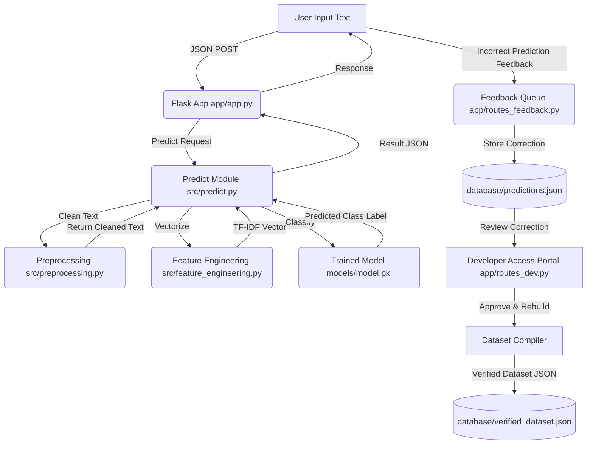

# AI Mood Detection System - Comprehensive Project Report

This report consolidates the complete architecture, pipeline, database workings, debugging details, and execution procedures of the **AI Mood Detection from Text** project.

---

## 1. System Architecture & Flow

The application functions as a machine learning pipeline integrated with a secure Flask web application. It processes user input to predict emotions and utilizes a feedback loop to let developers review, approve, and compile user-corrected entries back into the training dataset.



---

## 2. Directory Structure

The repository is organized to separate data, training assets, model files, source code, and web components. CSS and JS resources are grouped under dedicated folders to maintain a clean static structure:

* **`app/`**: Holds the web server, templates, and static resources.
  * `app.py`: Entry point for the Flask web application.
  * `routes_auth.py`: User registration, session tracking, and sign-out logic.
  * `routes_feedback.py`: Endpoint handling for predictions and feedback logging.
  * `routes_dev.py`: Administrative routes, analytics API, and database compile/backup tools.
  * `services/`: Core helper services (`auth_service.py`, `db_service.py`, `learning_service.py`).
  * `templates/`: HTML structures.
    * `index.html`: Main prediction portal.
    * `developer.html`: Developer/Admin admin portal.
  * `static/`: Contains client-side static files.
    * `css/`: Grouped style files (`style.css`, `auth.css`, `app.css`, `developer.css`).
    * `js/`: Grouped script files (`script.js`, `dev_script.js`).
    * `images/`: Image files used in layout.
* **`src/`**: Contains the core machine learning pipeline logic.
  * `preprocessing.py`: Handles text cleaning, formatting, and lemmatization.
  * `feature_engineering.py`: Configures the TF-IDF Vectorizer.
  * `train_model.py`: Trains and compares multiple models on the dataset.
  * `predict.py`: Handles single-text inference caching and pipeline execution.
  * `utils.py`: Centralized path utilities and pickle saving/loading.
* **`data/`**: Project dataset storage.
  * `processed/`: Processed datasets (`final_cleaned_data.csv.xls`).
  * `raw/`: Raw training/academic baseline csv datasets.
* **`database/`**: Stores JSON-based database files (`users.json`, `sessions.json`, `predictions.json`, `verified_dataset.json`).
* **`models/`**: Stores serialized trained files (`model.pkl` and `vectorizer.pkl`) and point-in-time model backups.

---

## 3. Detailed NLP & Machine Learning Pipeline

### A. Utility Helpers (`src/utils.py`)
Provides cross-platform absolute path resolution relative to the project root and handles saving/loading of Python objects via Pickle. This ensures directory references don't break whether code is executed from `app/` or `src/`.

### B. Text Preprocessing (`src/preprocessing.py`)
Converts raw, conversational text into normalized tokens:
1. **Case Normalization**: Converts all text to lowercase.
2. **Regex Filtering**: Removes non-alphabetic characters (punctuations, numbers).
3. **Length Filtering**: Discards short words (less than 3 characters).
4. **Lemmatization (NLTK)**: Normalizes words to their base dictionary form (e.g. "feeling" -> "feel") using `WordNetLemmatizer`.
   * *Graceful Fallback*: If NLTK or the `wordnet` corpus is not downloaded or crashes, it automatically falls back to basic regex cleaning so the application doesn't fail.

### C. Feature Engineering (`src/feature_engineering.py`)
Converts text into numerical feature vectors using **TF-IDF (Term Frequency-Inverse Document Frequency)**:
* Uses unigrams and bigrams (`ngram_range=(1, 2)`) to capture word pairs.
* Filters out common English stop words (`stop_words='english'`).
* Employs `sublinear_tf=True` to scale word frequencies logarithmically (reducing the impact of highly repetitive words).
* Limits features to `max_features=5000` to prevent overfitting and limit vocabulary dimensions.

### D. Model Training (`src/train_model.py`)
Loads the processed dataset, applies preprocessing, and runs model selection:
1. Splits data into **80% training** and **20% testing** sets.
2. Trains and evaluates multiple classification algorithms:
   * **Linear Support Vector Machine (SVM)** (SVC with linear kernel) — *Best performing model*
   * **RBF SVM** (SVC with Radial Basis Function kernel)
   * **Random Forest Classifier**
   * **Gradient Boosting Classifier**
3. Automatically selects the highest-accuracy model and serializes it along with the vectorizer to the `models/` directory as `model.pkl` and `vectorizer.pkl`.

### E. Inference Engine (`src/predict.py`)
Loads `model.pkl` and `vectorizer.pkl` lazily from disk and caches them in memory (`_model` and `_vectorizer`) to prevent slow disk reads on every HTTP request. Incoming text is preprocessed, vectorized, and classified via SVM decision functions.

---

## 4. Current Model Performance

The best model is **SVM (Linear)** with parameter `C=1`. It performs with high accuracy across 8,273 test and training samples:

| Metric | Score |
| :--- | :--- |
| **Accuracy** | **85.14%** |
| **Precision** | **85.26%** |
| **Recall** | **85.14%** |
| **F1-Score** | **84.73%** |

### Per-Emotion Performance Breakdown:
- **Sadness**: **90%** precision, **90%** recall, **90%** F1-score. Excellent balance.
- **Anger**: **89%** precision, **83%** recall, **86%** F1-score.
- **Fear**: **87%** precision, **77%** recall, **82%** F1-score.
- **Love**: **83%** precision, **58%** recall, **68%** F1-score. (Often confused with Joy).
- **Joy**: **81%** precision, **94%** recall, **87%** F1-score. Highest recall.
- **Surprise**: **77%** precision, **54%** recall, **64%** F1-score. (Rarest class, hardest to detect).

---

## 5. Developer Access Portal

The Developer Access Portal is styled with a premium **green-and-black cyber-hacker/terminal** theme and provides administrative functionalities:
1. **Overview & Live Analytics**: Displays registered users, active sessions, total logged predictions, accuracy trends, and common mismatch charts.
2. **Feedback Review Queue**: Review predictions flagged as incorrect by users. Admins can approve the proposed correct label, modify it, or reject the correction.
3. **Verified Dataset Manager**: Manage compiled data, import custom JSON batches, or export the verified training set.
4. **User Activity Monitor**: Monitor usernames, active/offline status, session timestamps, and total predictions/corrections submitted.
5. **Developer Tools**: Trigger the dataset compiler engine to rebuild `verified_dataset.json` from approved records, resolving duplicate entries.
6. **Audit Logs & Backups**: Track administrative actions (logins, deletions, approvals) and create restore-point database backups.

---

## 6. Access & Default Credentials

| Role | Username | Password | Email | Access Permissions |
| :--- | :--- | :--- | :--- | :--- |
| **User** | *(Choose during signup)* | *(Choose during signup)* | *(Choose)* | Mood prediction, verify predictions, feedback submission |
| **Meta-User** | `meta` | `metapassword` | `meta@moodai.dev` | User features + **Speech-to-Text microphone recording** |
| **Developer** | `admin` | `adminpassword` | `admin@moodai.dev` | Full Developer Portal (Dataset, Audits, Backups, Tools) |

---

## 7. Installation & Local Setup

### System Installation
1. **Create and Activate a Virtual Environment**:
   ```bash
   python -m venv venv
   # Windows:
   venv\Scripts\activate
   ```
2. **Install Dependencies**:
   ```bash
   pip install -r requirements.txt
   ```
3. **Download NLP Resources**:
   ```bash
   python -c "import nltk; nltk.download('punkt'); nltk.download('wordnet')"
   ```

### Running the Application
* **To Train the Model**:
  ```bash
  python src/train_model.py
  ```
* **To Run the Web Server**:
  ```bash
  python app/app.py
  ```
  * Access the main prediction app at `http://127.0.0.1:5000/`
  * Access the developer portal at `http://127.0.0.1:5000/developer`

---

## 8. Advanced Optimization Recommendations

1. **Class Weights**: Add `class_weight='balanced'` in SVC parameters to boost classification of minority classes like `surprise` and `love`.
2. **GridSearchCV/RandomizedSearchCV**: Run randomized hyperparameter tuning over `C`, `gamma`, and `kernel` spaces to squeeze 3-5% more accuracy.
3. **SMOTE Data Augmentation**: Use Synthetic Minority Over-sampling Technique to expand minority class examples.
4. **Voting Classifier Ensemble**: Combine SVM (Linear), SVM (RBF), and Gradient Boosting to increase predictions robustness.
